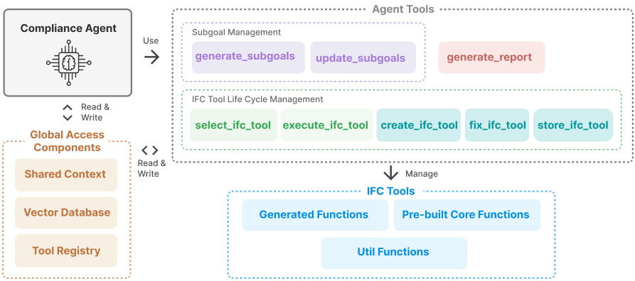
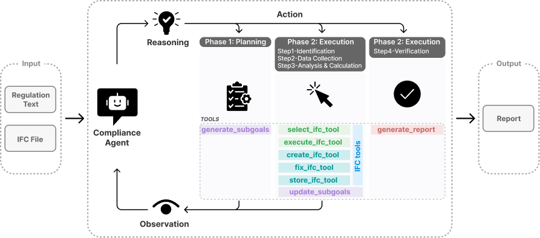

> <small>An AI-powered system that autonomously verifies building designs against regulatory codes using agentic AI and dynamic tool generation.</small>

[](https://www.python.org/downloads/)
[](https://fastapi.tiangolo.com/)
[](https://github.com/blau1234/AdaptiveACC)


<h4>Overview</h4>

<small>The ACC System transforms building code compliance checking from a manual, time-consuming process into an automated workflow powered by agentic AI. By leveraging Large Language Models (LLMs) with the ReAct (Reasoning + Acting) framework, the system autonomously interprets building regulations, explores IFC (Industry Foundation Classes) building models, and generates specialized tools on-demand to verify compliance.</small>

<small><strong>Key Innovation</strong>: Instead of requiring pre-programmed rules for every regulation, the system uses an autonomous agent that can reason about requirements, discover what data it needs, select or create custom analysis tools, and adapt its strategy based on findings - all without human intervention.</small>

---

<h4>System Architecture</h4>

<p align="center">
  
</p>

<small>The system implements a <strong>single-agent ReAct architecture</strong> where one autonomous agent orchestrates the entire compliance checking workflow by dynamically selecting and invoking specialized tools. The agent maintains global state through a shared context and can create new tools on-demand when existing capabilities are insufficient.</small>

<h5>Compliance Agent</h5>
<small>Autonomous reasoning engine (`agents/compliance_agent.py`) that runs ReAct loops: Thought (analyze situation) → Action (select tool) → Observation (process result). Each iteration is logged in SharedContext for complete audit trail.</small>

<h5>Agent Tools </h5>

- <small><strong>Subgoal Management</strong>: `generate_subgoals`, `review_and_update_subgoals` - Dynamic planning and progress tracking</small>
- <small><strong>IFC Tool Lifecycle</strong>: `select_ifc_tool`, `create_ifc_tool`, `execute_ifc_tool`, `fix_ifc_tool`, `store_ifc_tool` - Manage tool creation, testing, and persistence</small>


<h5>IFC Tools</h5>

- <small><strong>ifc_tool_utils</strong>: Atomic operations (IfcOpenShell wrappers)</small>

- <small><strong>Core Tools</strong> (20 pre-built): Generic exploratory tools, quantification, aggregation, topological operations</small>
- <small><strong>Generated Tools</strong>: Domain-specific tools dynamically created by agent</small>

<h5>Global Components</h5>

- <small><strong>SharedContext</strong>: Global state management - stores session info, subgoals, agent history, search summaries, compliance results</small>
- <small><strong>ToolRegistry</strong>: Auto-discovery and schema generation for all tools</small>
- <small><strong>VectorDatabase</strong>: ChromaDB for semantic tool search</small>

---

<h4>How It Works: Three-Phase Workflow</h4>
<p align="center">
  
</p>

<h5>Phase 1: Task Decomposition</h5>
<small>The agent starts by interpret the regulation, disambiguating technical terms to IFC concepts, then generating executable subgoals that follow a logical flow: Identification → Data Collection → Analysis → Verification.</small>

<h5>Phase 2: Adaptive Execution</h5>
<small>The agent executes subgoals using ReAct loops (Thought → Action → Observation). For each step, it searches for existing IFC tools and executes them. The agent can dynamically adjust its plan by reviewing progress and updating subgoals based on execution results.</small>


<small>When no suitable tool exists, the agent creates one via `create_ifc_tool` → sandbox test with `execute_ifc_tool` → fix errors with `fix_ifc_tool` → persist with `store_ifc_tool`.</small>


---

<h4>Technical Stack</h4>

<small>
<table>
  <thead>
    <tr>
      <th>Layer</th>
      <th>Technologies</th>
    </tr>
  </thead>
  <tbody>
    <tr>
      <td><strong>AI/ML</strong></td>
      <td>OpenAI GPT-4 / DeepSeek / <strong>Gemini</strong>, Instructor (structured outputs), ReAct framework</td>
    </tr>
    <tr>
      <td><strong>Backend</strong></td>
      <td>FastAPI, Pydantic models, Python 3.8+</td>
    </tr>
    <tr>
      <td><strong>BIM Processing</strong></td>
      <td>IfcOpenShell</td>
    </tr>
    <tr>
      <td><strong>Storage</strong></td>
      <td>ChromaDB (vector database), File system (tool persistence)</td>
    </tr>
    <tr>
      <td><strong>Frontend</strong></td>
      <td>Three.js (3D IFC visualization)</td>
    </tr>
    <tr>
      <td><strong>Observability</strong></td>
      <td>Phoenix (Arize) for distributed tracing, custom execution logging</td>
    </tr>
  </tbody>
</table>
</small>

---

<h4>Quick Start</h4>

<h5>Prerequisites</h5>

- <small>Python 3.8+</small>
- <small>Node.js 16+ (optional, for frontend development)</small>

<h5>Installation</h5>

```bash

# Install Python dependencies
pip install -r requirements.txt

# Set up environment variables
cp .env.example .env
# Edit .env and add your API keys:
# - OPENAI_API_KEY (for all LLM operations: OpenAI, DeepSeek, or Gemini)
# - EMBEDDING_API_KEY
# - PHOENIX_API_KEY (optional, for tracing)

# For Gemini API setup, see GEMINI_SETUP_GUIDE.md
```

<h5>Build Frontend (Optional)</h5>

<small>If you want to use the 3D IFC viewer interface:</small>

```bash
cd frontend
npm install
npm run build
cd ..
```

<small>This builds the Three.js-based frontend and outputs to `templates/`. Skip this if you only need API access.</small>

<h5>Run the System</h5>

```bash
# Start FastAPI server
python main.py

# Access web interface at http://localhost:8000
```
